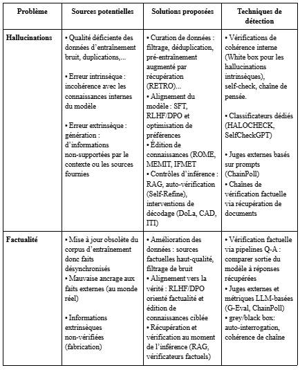
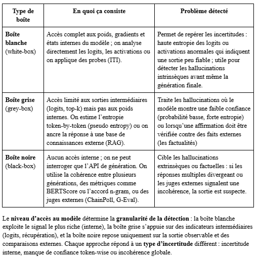

# Articles lus

Bienvenue dans le dossier `lu/` du repository **PFE Papers Summary**.  
Ce sous-dossier contient tous les articles que nous avons lus et résumés dans le cadre de notre PFE.

---

## Que trouve-t-on dans ce dossier ?

- Des fichiers Markdown (`.md`) pour chaque article étudié  
- Chaque fichier contient :
  - Le titre de l’article  
  - La référence ou le lien vers l’article  
  - Un résumé détaillé  
  - Les concepts clés  

---

## Article 1

### Titre
**A Survey on Hallucination in Large Language Models: Definitions, Detection, and Mitigation**

### Lien
[Lire l’article](https://www.preprints.org/frontend/manuscript/f9d1a7b519e1f4d5aa639cd7e0158fc0/download_pub)

### Résumé
L’article conclut que les hallucinations sont presque inévitables dans les modèles de génération probabiliste et que la voie la plus fiable consiste à intégrer l’estimation d’incertitude, la détection robuste et une supervision humaine dans une architecture en profondeur : données de haute qualité → alignement du modèle → contrôles d’inférence (RAG, auto‑vérification, interventions de décodage). 

### Concepts clés
- Hallucination dans les LLMs  
- Détection des hallucinations  
- Méthodes de mitigation  
- Évaluation des modèles

 <h3>Tableau 1</h3>

  

<h3>Tableau 2</h3>

  

---
